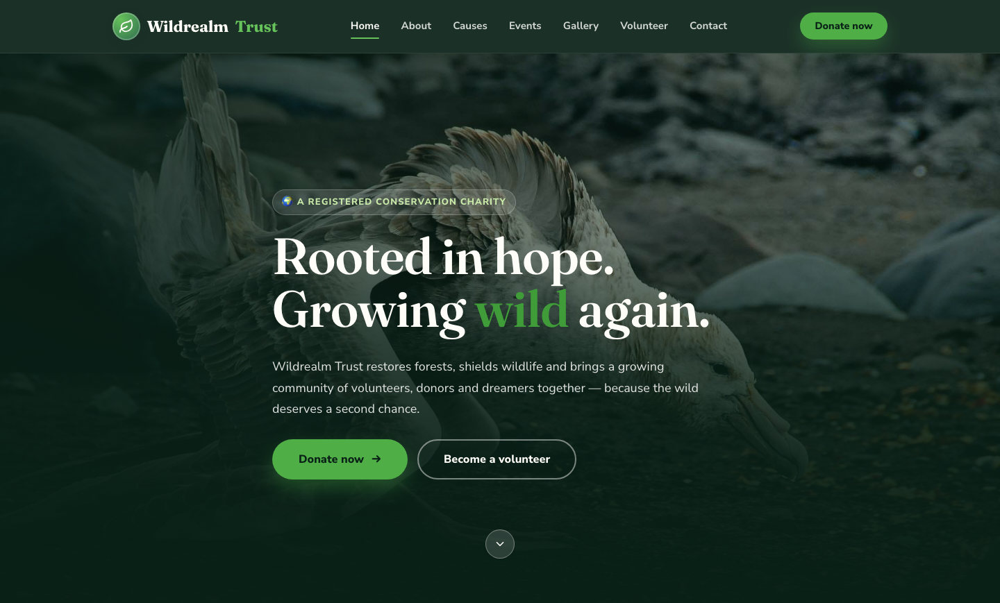

# Wildrealm Trust — Conservation Charity

A premium, framework-free HTML template for a conservation nonprofit restoring forests, protecting wildlife and rallying volunteers. A deep pine-green and moss palette with warm sun-bleached sand accents, driven by Fraunces display type and Nunito Sans body text — an organic, earthy home for a charity that plants trees, restores wetlands and builds community action.

## 📸 Screenshot

## Design System

| Token | Value |
|-------|-------|
| **Ground** | `--pine-800` `#123528` (deep pine), `--sand-100` `#f7f3ea` (light) |
| **Primary** | `--leaf-400` `#66c25a` (fresh green), `--moss-500` `#3a7d5c` (moss) |
| **Secondary** | `--accent` `--leaf-500` `#4fae46`, `--lime-200` `#c9eaa9` |
| **Text** | `--ink-900` `#1e2d26`, `--ink-500` `#6d7c72`, `--ivory` `#fffdf8` (on dark) |
| **Display type** | `Fraunces` (serif, 500–700, soft organic curves) |
| **Body type** | `Nunito Sans` (sans, 400–800) |
| **Container** | 1180px max-width, centered |
| **Breakpoints** | ~1020px (grid collapse), ~780px (mobile nav), ~640px (mobile) |

## Pages

| Page | File | Description |
|------|------|-------------|
| Home | [index.html](index.html) | Hero with crossfade, impact stats, causes, events, volunteer band, gallery, call to action |
| About | [about.html](about.html) | Story, impact stats, core values, journey timeline |
| Causes | [causes.html](causes.html) | Four cause cards with live funding progress and fund-allocation breakdown |
| Events | [events.html](events.html) | Event cards with date badges, calendar view, and what-to-expect timeline |
| Gallery | [gallery.html](gallery.html) | Masonry gallery grid with captions and field quotes |
| Volunteer | [volunteer.html](volunteer.html) | Get-involved form, roles grid, volunteer stories and sign-up CTA |
| Donation | [donation.html](donation.html) | Donation form with tiered amounts, impact stats, and fund-allocation grid |
| Contact | [contact.html](contact.html) | Contact form with `[data-form]` validation, info cards, and FAQ accordion |

## Features

- **Framework-free** — pure HTML5, CSS3 (custom properties, Grid, Flexbox, `clamp()`), vanilla JavaScript
- **Organic conservation aesthetic** — deep pine greens, moss earth tones, fresh-leaf accents and sun-bleached sand
- **Fluid responsive** — three breakpoints, no horizontal scroll on any viewport
- **Scroll reveal** — IntersectionObserver-powered `.reveal` animations (respects `prefers-reduced-motion`)
- **Mobile nav** — burger toggle with `aria-expanded` accessible pattern
- **Hero crossfade** — automatic 6s image transition via `.hero-bg img` + `.active` class
- **Impact stats** — bold stat displays with suffix styling for measurable results
- **Cause cards** — funding progress bars and goal tracking for each campaign
- **Volunteer cards** — avatar grid with role and testimonial
- **Timeline layout** — `.timeline` rows for journey milestones and event schedules
- **Accordion FAQ** — `
`-based expandable questions with animated icons
- **Donation tiers** — radio button group with styled labels for one-click amount selection
- **Form validation** — `[data-form]` hook with `.form-ok` / `.form-err` / `.show` toggle
- **Original imagery** — production-quality conservation photography, no placeholders

## Tech Stack

- HTML5 + CSS3 (W3C-valid, semantic landmarks)
- Vanilla JavaScript (canonical IIFE build)
- Google Fonts (Fraunces + Nunito Sans)
- SVG favicon (inline data: URI)

## SEO

- Semantic HTML5 structure (`<header>`, `<nav>`, `<main>`, `<section>`, `<footer>`)
- Unique `<title>` and `<meta description>` per page
- `lang="en"` attribute, `charset="utf-8"`, viewport meta
- Alt text on all images

## License

Free for personal and commercial use. Attribution appreciated but not required.

---

## Let's Build Something Together 🚀

[Book a free consultation](https://tally.so/r/q4q1L9)